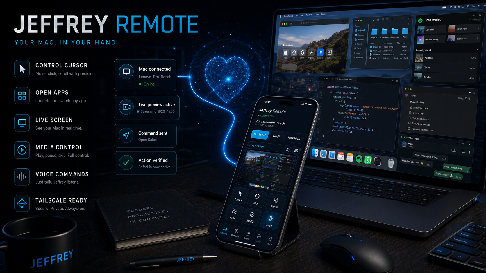
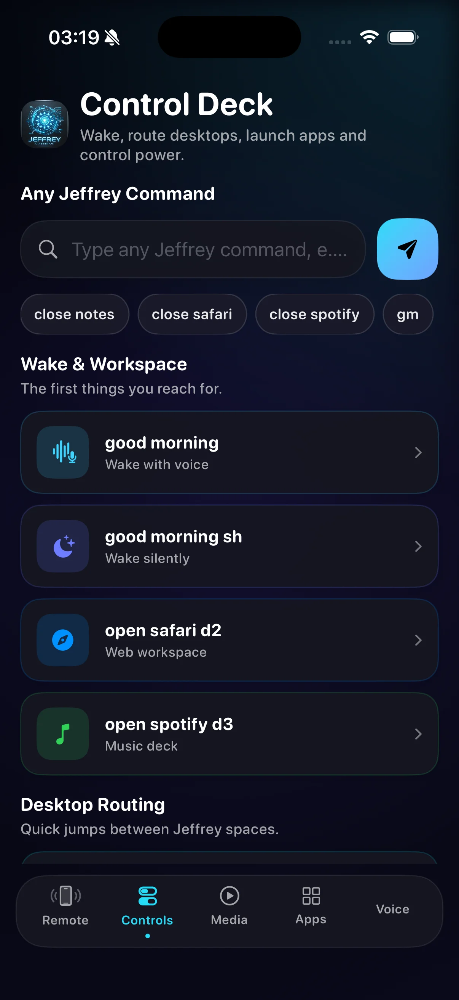
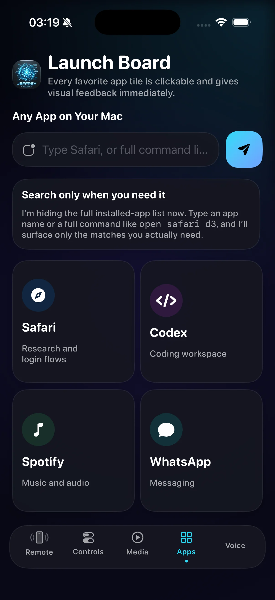

# Jeffrey Remote

Native SwiftUI control surface for Jeffrey and the Mac. It provides live preview, cursor control, commands, media, apps, workspaces, voice and power actions over a resilient direct connection.

## Real screens

| Control deck | Launch board |
| --- | --- |
|  |  |

## Why it exists

An autonomous agent becomes more useful away from the desk, but remote actions need visibility and trust. Jeffrey Remote keeps the operator in the loop with live state, explicit actions and connection feedback.

## Architecture

The iPhone app uses SwiftUI and Network.framework. It discovers the Mac through Bonjour when local, supports direct host configuration for Tailscale or a hotspot, exchanges newline delimited JSON and applies task specific timeouts for commands, screenshots and app catalogs.

## Features

Live screen preview, trackpad style cursor, keyboard input, searchable apps, curated workspaces, media control, text to speech, connection health, automatic reconnect and Mac power actions.

## Run

Open `JeffreyRemote.xcodeproj` in Xcode, select an iPhone target and run. Set the Mac host inside the app. The included Tailscale address is a documentation placeholder.

## CA

App nativa SwiftUI per controlar Jeffrey i el Mac des de l'iPhone amb vista en directe, cursor, ordres, apps, multimèdia i reconnexió resilient.

## ES

App nativa SwiftUI para controlar Jeffrey y el Mac desde el iPhone con vista en directo, cursor, comandos, apps, multimedia y reconexión resiliente.
